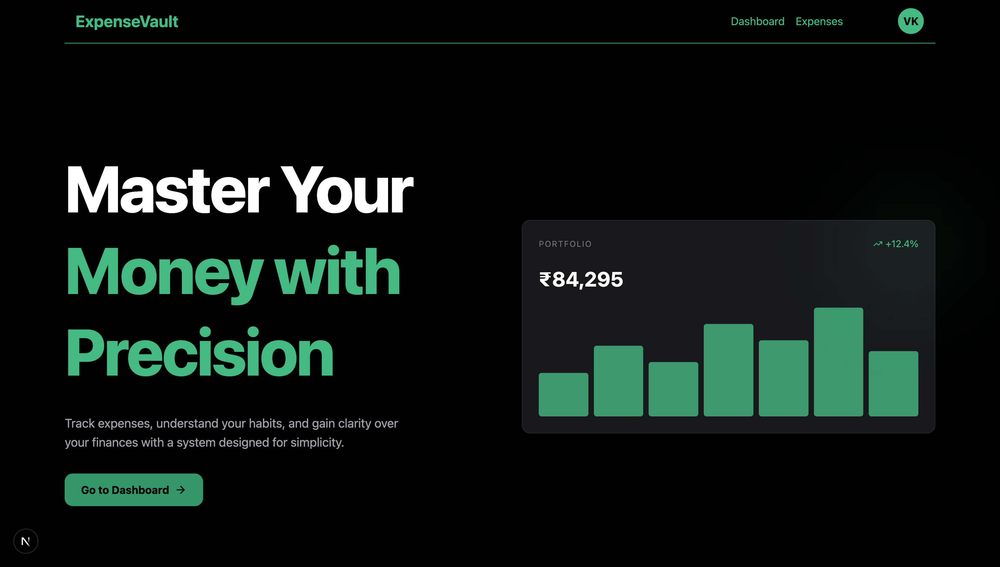

## ExpenseVault

ExpenseVault is a full-stack expense tracking application built to help users track, analyze, and manage their daily expenses with clarity and precision. It provides a clean interface, secure authentication, and insightful visualizations to improve financial decision-making.

---

## Features

- **Authentication** – Secure login/signup using JWT (HTTP-only cookies)
- **Expense Management** – Create, read, update, and delete expenses
- **Dashboard Analytics** – Visual insights using charts (Pie & Bar)
- **Date Filtering** – Filter expenses by specific dates
- **Real-time Updates** – Instant UI updates after actions
- **Modern UI** – Responsive design with Tailwind CSS
- **Protected Routes** – Middleware-based route protection

---

## Tech Stack

### Frontend

- Next.js 16 (App Router)
- React 19
- Tailwind CSS
- Recharts

### Backend

- Next.js API Routes

### Database

- MongoDB (Mongoose)

### Authentication

- JWT (HTTP-only cookies)
